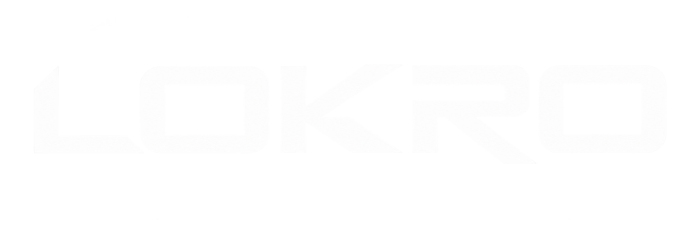

<div align="center">
  
  <h1>LOKRO — Ein Netzwerk für alle</h1>
  <p><strong>LOKRO V2.1.0 &lt;-&gt; Carrotcake</strong></p>
  <p>Non-Profit-Netzwerk · 7 Sprachen · 100 % statisch · läuft auf GitHub Pages</p>
  <p>
    <a href="https://lokro.dev"><strong>🌐 lokro.dev besuchen</strong></a>
  </p>
  <p>
    
    
    
  </p>
</div>

---

## Was ist LOKRO?

LOKRO ist ein **Non-Profit-Projektnetzwerk**: kostenlose Tools, Spiele und Communities – ohne Paywall, ohne Tracking, ohne Abo. Diese Website ist die zentrale Anlaufstelle des Netzwerks: Projekte entdecken, Team beitreten, Hall of Fame, Changelog und Roadmap.

**Prinzipien:** Zugang ist kein Luxus · Community-getrieben · selbst entwickelt · für immer kostenlos.

## Tech-Stack


Die Seite selbst kommt bewusst ohne Framework aus: **HTML + Tailwind CSS + Vanilla JS**, geteilte Assets unter `assets/` (`site.css`, `site.js`), Daten als JSON. Kein Build-Schritt, kein Backend – deployt direkt per GitHub Pages.

## Projektstruktur

```
├── index.html              # Sprach-Router (leitet auf /de/, /en/, … weiter)
├── 404.html                # Eigene 404-Seite mit Sprachauswahl
├── de/ en/ es/ fr/ it/ la/ tr/   # Eine Seite pro Sprache …
│   ├── index.html          # … Startseite
│   ├── join.html           # … Bewerbungsportal
│   ├── hall-of-fame.html   # … Hall of Fame
│   ├── changelog.html      # … Changelog (aus JSON gerendert)
│   ├── roadmap.html        # … Roadmap (aus JSON gerendert)
│   └── settings.html       # … Einstellungen & Themes (localStorage)
├── assets/                 # site.css, site.js, Logos, Bilder
├── src/JSON/               # Alle Daten als JSON (siehe unten)
│   ├── applications*.json  # Offene Positionen (7 Sprachen)
│   ├── hall-of-fame*.json  # Hall-of-Fame-Einträge (7 Sprachen)
│   ├── changelog*.json     # Changelog-Einträge (7 Sprachen, auto-sync)
│   ├── roadmap.json        # Roadmap (mehrsprachig, 1 Datei)
│   └── Projects/           # Projekt-Einstellungen
├── .github/workflows/      # CI: Changelog-Bump + Changelog-Sync
├── sitemap.xml / robots.txt / CNAME
└── bewerbung.html / hall-of-fame.html  # Weiterleitungen (Legacy-URLs)
```

**URLs:** `lokro.dev/{sprache}/` bzw. `lokro.dev/{sprache}/{seite}.html` – z. B. `lokro.dev/tr/roadmap.html`. Die Sprache steht immer in der URL und wird in `localStorage` gespeichert.

## Inhalte pflegen

### Roadmap (`src/JSON/roadmap.json`)

Eine einzige Datei für alle Sprachen – einfach Eintrag hinzufügen oder `status` ändern:

```json
{
  "id": "mein-feature",
  "status": "planned",
  "eta": null,
  "title": { "de": "Mein Feature", "en": "My feature", "...": "..." },
  "description": { "de": "Kurze Beschreibung.", "en": "Short description.", "...": "..." }
}
```

- `status`: `planned` (Geplant) · `in-progress` (In Arbeit) · `done` (Erledigt)
- `title` / `description`: je ein Text pro Sprache (`de`, `en`, `es`, `fr`, `it`, `la`, `tr`) – fehlende Sprachen fallen automatisch auf Englisch bzw. Deutsch zurück
- `eta`: optionaler Zeit-Hinweis als freier Text (oder `null` weglassen)

### Themes & Einstellungen (`/{sprache}/settings.html`)

Themes sind reine `localStorage`-Daten (Keys: `lokro-settings`, `lokro-themes`, daneben `lokro-theme` für Hell/Dunkel) – kein Backend, kein Konto. Auf der Settings-Seite können Themes erstellt, installiert, exportiert (`.lokro-theme.json`) und importiert werden; dazu kommen Schalter für das Cursor-Easter-Egg (Standard: aus, nur Original-Theme) und reduzierte Bewegung.

Theme-Format (`version: 1`): `{ id, name, colors: {<alle CSS-Variablen aus `:root` als `#hex}>`, headerShadow: bool, author: { name, platform, username } | null }`. Autoren-Links werden **nie** freihändig übernommen, sondern aus einer Allowlist (`github`, `instagram`, `tiktok`, `youtube`, `twitch`, `x`) + sanitize-tem Username gebaut – das steht auch im Footer jeder Seite („Erstellt von …"). Showcase-Themes für alle liegen in `src/JSON/showcase-themes.json` (leeres Array = Platzhalter).

### Changelog (automatisch)

Neue Einträge entstehen von selbst: Bei jedem Push auf `main` feuert `.github/workflows/changelog.yaml` einen Webhook an [AutoChangelog](https://autochangelog.com), danach holt `.github/workflows/sync-changelog.yml` die veröffentlichten Einträge per REST-API oder RSS-Feed ab und schreibt sie nach `src/JSON/changelog*.json`. Leere Antworten überschreiben nichts Bestehendes.

**Einmalig einrichten** (nur Repo-Owner, unter Settings → Secrets and variables → Actions):
- Secret `AUTOCHANGELOG_WEBHOOK_SECRET` – Signatur für den Bump-Webhook
- Secret `AUTOCHANGELOG_API_KEY` – Lese-Zugriff (nur für API-Modus nötig)
- Variablen (optional): `CHANGELOG_SOURCE` (`api`/`rss`), `CHANGELOG_RSS_URL`, `AUTOCHANGELOG_OWNER`, `AUTOCHANGELOG_REPO`

### Bewerbungen & Hall of Fame

`applications*.json` und `hall-of-fame*.json` liegen pro Sprache vor (`-en`, `-es`, `-fr`, `-it`, `-la`, `-tr`, ohne Suffix = Deutsch) und werden von den jeweiligen Seiten per `fetch()` geladen.

## Mitmachen

LOKRO wächst durch Menschen, die mitgestalten wollen – alles ehrenamtlich:

- 💬 [Discord beitreten](https://discord.lokro.dev)
- 💻 [Auf GitHub](https://github.com/Lokrogaming) – Issues und PRs willkommen
- 📝 [Bewerben](https://lokro.dev/de/join.html) – offene Positionen im Portal

---

<div align="center">
  <sub>LOKRO ist ein 100&nbsp;% non-profit Projekt-Netzwerk. Alle Angebote sind kostenlos nutzbar.</sub>
</div>
